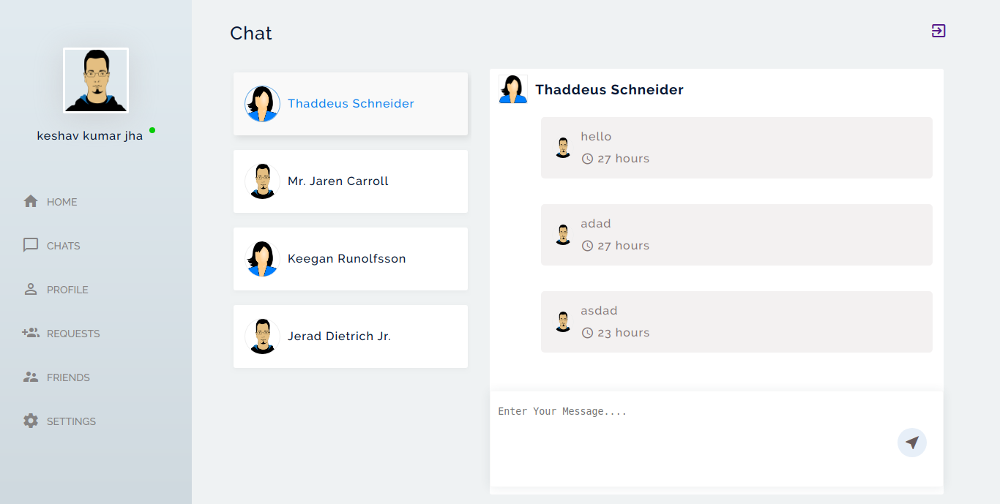

# LaraTalk

A Chat application with laravel and laravelwebsocket.

# Technology that are used in this projects
* [Laravel 5.8](https://laravel.com/docs/5.8)
* [Laravel WebSockets](https://docs.beyondco.de/laravel-websockets/1.0/getting-started/introduction.html)
* [php pusher Server](https://github.com/pusher/pusher-http-php)
* [Laravel Echo](https://github.com/laravel/echo)
* [pusher js](https://github.com/pusher/pusher-js)

# Implemented functionalities are

1. Authentication.
2. All Users list with pagination and search option.
3. Send requests to anothers, canceling sent requests, accepting requests,reject the arrived request and make user unfriend.
4. request page to seee sent and arrived requests and take action over that.
5. friends page to see all the friends.
6. profile page to see the profile (incling last login time).
7. setting page to change email_hide and gender hide option (so if you hide your gender and email no one will see it).

# Check Out the application snapshots.

[Application Snapshots for different pages](https://github.com/keshav98/LaraTalk/tree/master/public/assets/images)

